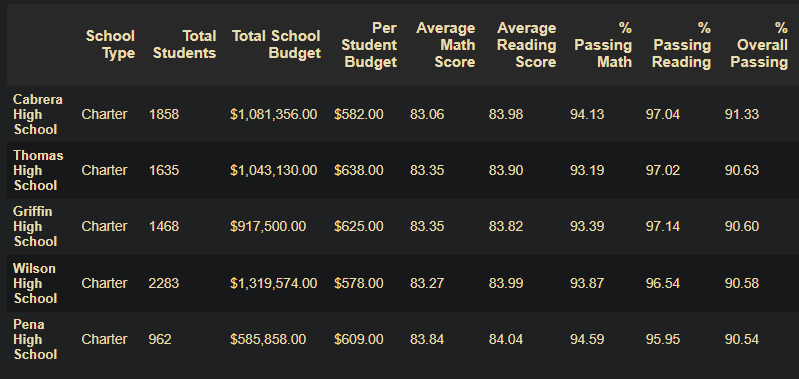
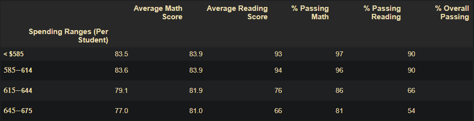
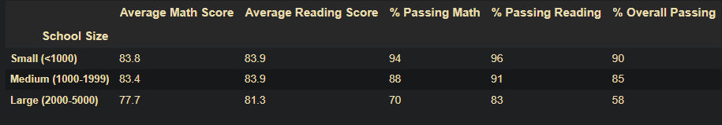

# School District Analysis

## Project Overview - Overview of the school district analysis: Explain the purpose of this analysis.

This project's purpose was to analyses two data sets provided by a school district. The district has 15 high schools, a mix of district run schools and charter schools. There are 39,170 students total in the district. The data that was analyzed included the state mandated standardized test scores for all student as well as data on each school including total students and annual budget. 

During the course of our analysis an academic integrity issue arose with a subset of students, ninth graders at Thomas High School, invalidating their standardized test scores The analysis and summary statistics needed to be recompiled after dropping the questionable data.

## Results:

As mentioned in the introduction during the course of our analysis we were told the test results of all 9th graders at Thomas High School were invalidated and are not be included in this analysis. 

#### District Summary

Since we had already run our preliminary analysis before being told to drop the scores we were able to look at the changes in the overall numbers that dropping the offending scores made. 

The following observations were made after performing the second analysis:
* The overall percentage of students at Thomas High School who passed both standardized tests (math and reading) fell to 65%
* The overall passing percentage for the entire district was reduced to 64.9%
* Thomas High School, which initial placed in the top five schools within the district fell from that position and into the middle group of schools based on test performance.

### Top 5 Schools

#### Bottom Five Schools

### Factors Affecting Student Performance
Our analysis shows that there is not an obvious relationship between per pupil funding and student outcomes. However, school size does seem to have a direct correlation. The figures below illustrate our findings.

#### Spending per Pupil
Schools are broken down into four groups based on spending per student. Average math and reading scores as well as percentage of students passing do not vary in a statistically significant way across the four groups.

#### School Size
Schools are broken down into three groups based on total student count. Average math and reading scores as well as percentage of students passing are significantly better for schools with under 1,000 students. The worst performing schools are the ones with the most students.

### Further Statistics
#### Math Scores by Grade and School

#### Reading Scores by Grade and School

#### Scores by School Type

## Summary:

The data analysis paints an almost complete picture of the performance of each school in the district and drilling down further, each grade level in each school. This picture can not be considered complete without the having accurate data for all students.
